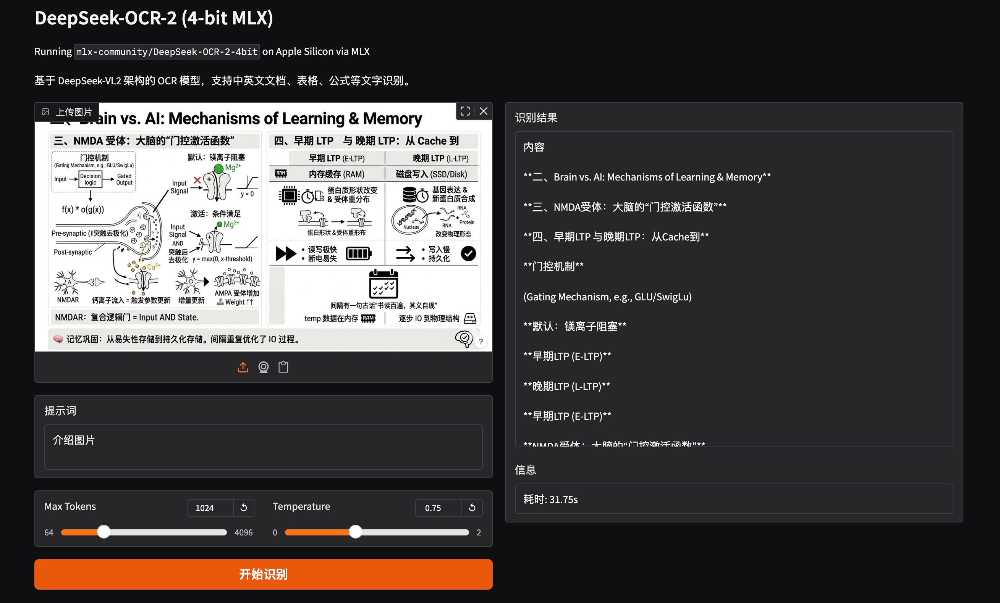

# MLX DeepSeek-OCR-2 Gradio Web Demo

在 Apple Silicon 上通过 MLX 运行 [DeepSeek-OCR-2-4bit](https://huggingface.co/mlx-community/DeepSeek-OCR-2-4bit)，使用 Gradio 提供 OCR 文字识别 Web 界面。



## 模型简介

DeepSeek-OCR-2 是基于 DeepSeek-VL2 架构的视觉语言模型，专注于 OCR（光学字符识别）任务。本仓库使用 `mlx-vlm` 将 4-bit 量化模型在 Apple Silicon 上高效推理。

主要特性：

- **4-bit 量化**：显著降低显存占用，适合 Apple Silicon 本地运行
- **多语言 OCR**：支持中文、英文、日文、韩文等多语言文字识别
- **复杂版式**：支持文档、表格、公式、代码等复杂排版识别
- **指令跟随**：通过提示词控制输出格式和识别范围

## 环境要求

- macOS Apple Silicon (M1/M2/M3/M4)
- Conda (Miniconda / Anaconda)
- ~5GB 磁盘空间（模型首次运行自动下载）

## 快速启动

```bash
# 1. 创建并激活 conda 环境
conda create -n deepseek-ocr python=3.12 -y
conda activate deepseek-ocr

# 2. 安装依赖
pip install mlx-vlm gradio

# 3. 启动
python app.py
```

首次运行会自动从 HuggingFace 下载模型到项目目录下的 `models/` 文件夹，后续直接使用本地模型。

启动后浏览器打开 **http://localhost:7864** 即可使用。

## 使用方法

1. 上传需要识别文字的图片（文档截图、表格、公式等）
2. 可自定义提示词（默认为识别所有文字并按原格式输出）
3. 点击「开始识别」获取结果

## 参数说明

| 参数 | 默认值 | 说明 |
|------|--------|------|
| Max Tokens | 1024 | 最大生成 token 数 |
| Temperature | 0.0 | 生成随机性，OCR 任务建议设为 0 |

## 常见问题

**Q: 模型下载慢？**

设置 HuggingFace 镜像：
```bash
export HF_ENDPOINT=https://hf-mirror.com
python app.py
```

**Q: 使用代理时启动报 SOCKS 错误？**

程序在模型下载完成后会自动清除代理环境变量。如果仍有问题，可在启动前安装 socks 支持：
```bash
pip install "httpx[socks]"
```

**Q: 识别效果不好？**

尝试调整提示词，例如：
- 表格识别：「请识别图片中的表格，用 Markdown 格式输出。」
- 公式识别：「请识别图片中的数学公式，用 LaTeX 格式输出。」
- 部分识别：「请仅识别图片左半部分的文字。」

**Q: 如何卸载环境？**

```bash
conda deactivate
conda remove -n deepseek-ocr --all
```

**Q: 如何清除模型缓存？**

```bash
rm -rf models/mlx-community--DeepSeek-OCR-2-4bit
```
