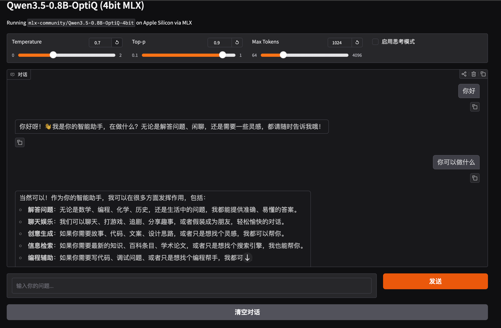
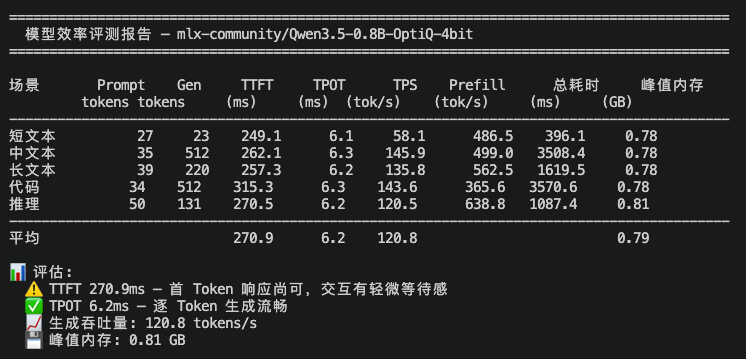

# MLX Qwen3.5-0.8B Gradio Web Demo

在 Apple Silicon 上通过 MLX 运行 [Qwen3.5-0.8B-OptiQ-4bit](https://huggingface.co/mlx-community/Qwen3.5-0.8B-OptiQ-4bit)，使用 Gradio 提供 Web 聊天界面。


## 环境要求

- macOS Apple Silicon (M1/M2/M3/M4)
- Conda (Miniconda / Anaconda)
- ~2GB 磁盘空间（模型首次运行自动下载）

## 快速启动

```bash
# 1. 创建并激活 conda 环境
conda create -n mlx-qwen python=3.11 -y
conda activate mlx-qwen

# 2. 安装依赖
pip install mlx-lm gradio

# 3. 启动
python app.py
```

首次运行会自动从 HuggingFace 下载模型到项目目录下的 `models/` 文件夹，后续直接使用本地模型。

启动后浏览器打开 **http://localhost:7860** 即可使用。

## 参数说明

| 参数 | 默认值 | 说明 |
|------|--------|------|
| Max Tokens | 1024 | 单次回复最大生成长度 |
| Temperature | 0.7 | 越高越随机，0 为贪心解码 |
| Top-p | 0.9 | 核采样概率阈值 |
| Enable Thinking | 关闭 | 开启后模型会先输出思考过程再给答案 |


## 性能评测

运行 `benchmark.py` 可对模型在本地 Apple Silicon 上的推理效率进行评测：

```bash
python benchmark.py
```

评测指标：

| 指标 | 说明 |
|------|------|
| TTFT | 首 Token 延迟，越低交互响应越快 |
| TPOT | 每 Token 平均延迟 |
| TPS | 生成吞吐量 (tokens/s) |
| Prefill | Prompt 预填充吞吐量 (tokens/s) |
| 峰值内存 | 推理过程最大内存占用 |

以下为 **M1 Pro** 上的实测结果（4-bit 量化，贪心解码，每场景重复 3 次取均值）：

| 场景 | Prompt tokens | Gen tokens | TTFT (ms) | TPOT (ms) | TPS (tok/s) | Prefill (tok/s) | 峰值内存 (GB) |
|------|--------------|------------|-----------|-----------|-------------|-----------------|--------------|
| 短文本 | 27 | 23 | 249.1 | 6.1 | 58.1 | 486.5 | 0.78 |
| 中文本 | 35 | 512 | 262.1 | 6.3 | 145.9 | 499.0 | 0.78 |
| 长文本 | 39 | 220 | 257.3 | 6.2 | 135.8 | 562.5 | 0.78 |
| 代码 | 34 | 512 | 315.3 | 6.3 | 143.6 | 365.6 | 0.78 |
| 推理 | 50 | 131 | 270.5 | 6.2 | 120.5 | 638.8 | 0.81 |
| **平均** | — | — | **270.9** | **6.2** | **120.8** | — | **0.81** |


评测结果会同时保存到 `benchmark_result.json`。

## 常见问题

**Q: 模型下载慢？**

设置 HuggingFace 镜像：
```bash
export HF_ENDPOINT=https://hf-mirror.com
python app.py
```

**Q: 显存/内存不足？**

此模型为 4-bit 量化版本，约占用 ~1GB 内存，M1 8GB 机型可流畅运行。

**Q: 如何卸载环境？**

```bash
conda deactivate
conda remove -n mlx-qwen --all
```

**Q: 如何清除模型缓存？**

```bash
rm -rf models/mlx-community--Qwen3.5-0.8B-OptiQ-4bit
```
