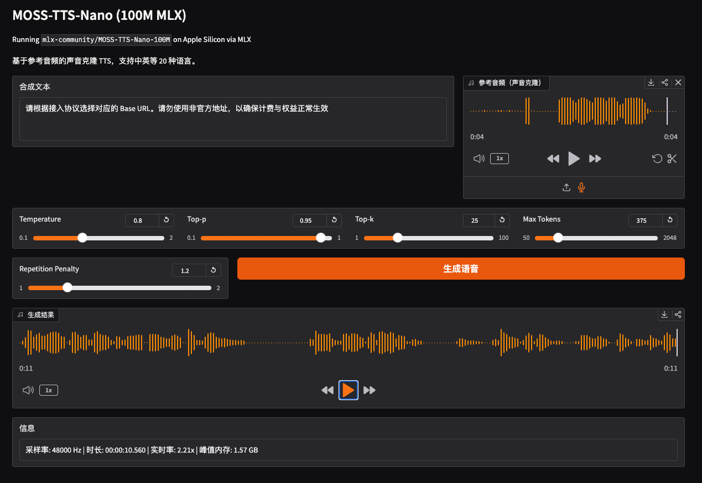

# MLX MOSS-TTS-Nano Gradio Web Demo

在 Apple Silicon 上通过 MLX 运行 [MOSS-TTS-Nano-100M](https://huggingface.co/mlx-community/MOSS-TTS-Nano-100M)，使用 Gradio 提供 TTS 声音克隆 Web 界面。



## 模型简介

MOSS-TTS-Nano 是由 [MOSI.AI](https://mosi.cn/) 和 [OpenMOSS](https://www.open-moss.com/) 团队开源的多语言语音生成模型，仅 0.1B 参数，支持基于参考音频的声音克隆。本仓库使用 `mlx-audio` 将模型转换为 MLX 格式，在 Apple Silicon 上高效推理。

主要特性：

- **0.1B 参数**：模型极小，CPU 亦可运行
- **48kHz 双声道**：原生高保真音频输出
- **20 种语言**：中、英、日、韩、德、法、西等
- **声音克隆**：上传参考音频即可复刻音色
- **纯自回归架构**：Audio Tokenizer + LLM 流水线

## 环境要求

- macOS Apple Silicon (M1/M2/M3/M4)
- Conda (Miniconda / Anaconda)
- ~1GB 磁盘空间（模型 + Audio Tokenizer 首次运行自动下载）

## 快速启动

```bash
# 1. 创建并激活 conda 环境
conda create -n moss-tts-nano python=3.12 -y
conda activate moss-tts-nano

# 2. 安装依赖
pip install mlx-audio gradio

# 3. 启动
python app.py
```

首次运行会自动从 HuggingFace 下载模型到项目目录下的 `models/` 文件夹，后续直接使用本地模型。

启动后浏览器打开 **http://localhost:7861** 即可使用。

## 使用方法

1. 在「合成文本」框中输入要合成的文字
2. 上传一段参考音频（用于声音克隆，建议 3-10 秒的清晰人声）
3. 调整参数后点击「生成语音」

## 参数说明

| 参数 | 默认值 | 说明 |
|------|--------|------|
| Temperature | 0.8 | 生成随机性，越低越稳定 |
| Top-p | 0.95 | 核采样概率阈值 |
| Top-k | 25 | 采样候选数 |
| Max Tokens | 375 | 最大生成音频帧数 |
| Repetition Penalty | 1.2 | 重复惩罚系数，防止音频循环 |

## 关于 MLX Audio

MLX Audio 是基于 MLX 框架的音频模型推理库，支持 TTS、STT、STS 等多种任务。与 PyTorch + CUDA 的传统方案不同，MLX Audio 充分利用 Apple Silicon 的统一内存架构，数据在 CPU 和 GPU 之间零拷贝传输，特别适合本地单用户场景。

```
# PyTorch + CUDA 音频推理架构
┌───────────────────────────────┐
│        应用层 / 服务层         │
│  TTS / STT API Server         │
└───────────────▲───────────────┘
                │
┌───────────────┴───────────────┐
│     PyTorch + Transformers    │
│  - GPU Tensor 运算             │
│  - CUDA Kernel                │
└───────────────▲───────────────┘
                │
┌───────────────┴───────────────┐
│     CUDA / cuDNN / cuBLAS     │
└───────────────▲───────────────┘
                │
┌───────────────┴───────────────┐
│        NVIDIA GPU             │
│  独立显存 (HBM / GDDR)        │
│  CPU ↔ GPU 数据拷贝开销大     │
└───────────────────────────────┘

# MLX Audio 推理架构
┌───────────────────────────────┐
│        应用层 / 服务层         │
│  Gradio Web Demo / CLI        │
└───────────────▲───────────────┘
                │
┌───────────────┴───────────────┐
│         mlx-audio             │
│  - TTS / STT / STS 模型封装   │
│  - 量化推理支持               │
└───────────────▲───────────────┘
                │
┌───────────────┴───────────────┐
│              MLX              │
│  - Tensor / Autograd          │
│  - Metal GPU 后端             │
│  - 统一内存零拷贝              │
└───────────────▲───────────────┘
                │
┌───────────────┴───────────────┐
│        Apple Silicon          │
│  CPU + GPU + NPU              │
│  Unified Memory (统一内存)     │
└───────────────────────────────┘
```

## 常见问题

**Q: 模型下载慢？**

设置 HuggingFace 镜像：
```bash
export HF_ENDPOINT=https://hf-mirror.com
python app.py
```

**Q: 使用代理时启动报 SOCKS 错误？**

程序在模型下载完成后会自动清除代理环境变量。如果仍有问题，可在启动前安装 socks 支持：
```bash
pip install "httpx[socks]"
```

**Q: 参考音频有什么要求？**

建议使用 3-10 秒的清晰人声录音，背景噪声少、无音乐的片段效果最佳。支持 wav/mp3/flac 等常见格式。

**Q: 如何卸载环境？**

```bash
conda deactivate
conda remove -n moss-tts-nano --all
```

**Q: 如何清除模型缓存？**

```bash
rm -rf models/mlx-community--MOSS-TTS-Nano-100M
```
